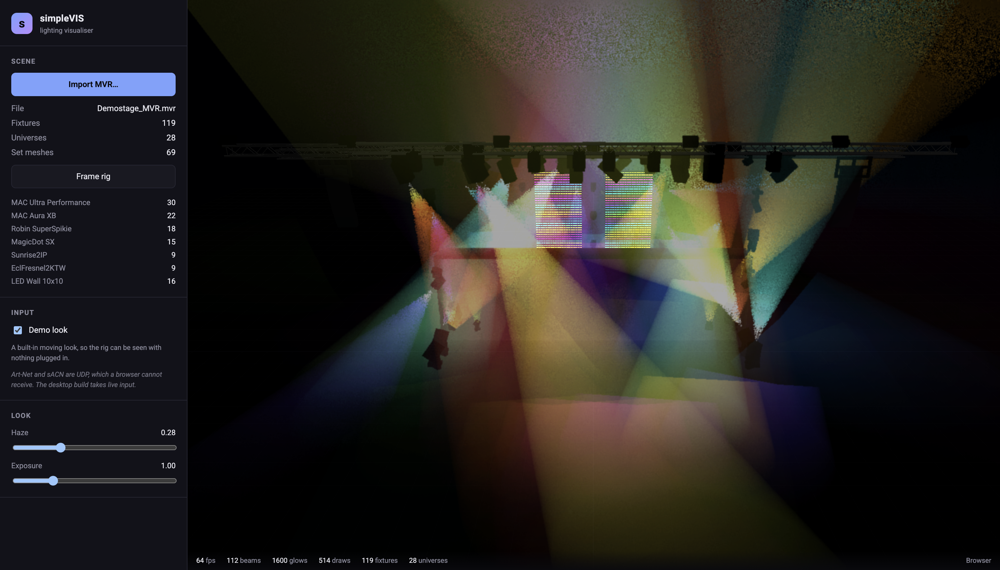
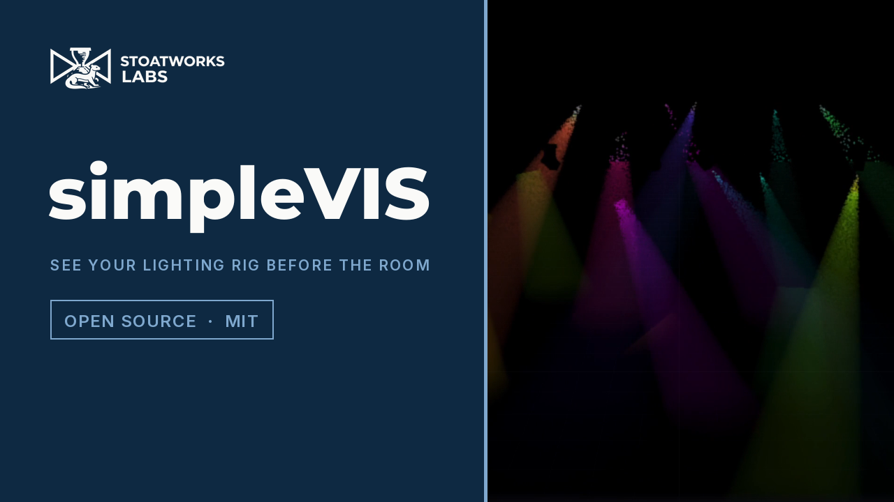

# simpleVIS

> **AI-assisted project.** This codebase was created with [Claude](https://claude.com/claude-code)
> (Anthropic), directed and reviewed by a human author. MVR and GDTF import is
> tested against real files, and the Art-Net and sACN parsers against real packet
> layouts. **Nothing has been driven by a real console or a real DMX interface
> yet**, so levels and patch coming from a desk remain unverified — see
> [Verified vs assumed](#verified-vs-assumed).

A lightweight real-time lighting visualiser. Import an MVR, take live levels
over Art-Net, sACN or USB DMX, fly a camera around the rig, and see your
programming in volumetric haze.



## What it is for

Seeing what a rig will do before you are in the room with it — checking looks
and coverage against a real patch, without a visualiser licence and without
modelling the venue by hand.

## Two builds, and why

Art-Net and sACN are UDP, and **a browser cannot receive UDP** — there is no
flag, polyfill or workaround. So simpleVIS ships two targets from one codebase:

| Build | What it is | Live input |
|---|---|---|
| **Desktop** (Tauri v2) | the real tool | Art-Net, sACN, USB DMX |
| **Hosted** | offline previz and plot viewer in a tab | none — built-in demo look |

The shared code is identical; only the transport differs. The hosted build
*hides* what it cannot do rather than offering controls that fail.

## Import

**MVR** (`.mvr`), including the GDTF fixture definitions embedded inside it —
geometry tree, DMX modes, beam angles, colour mixing. Import only; simpleVIS
never writes MVR.

Pixel-mapped fixtures work: an MVR whose LED wall declares four template
channels across a hundred `GeometryReference`s is correctly resolved to its real
300-channel footprint, one DMX slot per pixel.

## Input

| Protocol | Notes |
|---|---|
| **sACN** (E1.31) | Priority arbitration, CID source identity, multicast group joins per patched universe |
| **Art-Net 4** | ArtDmx, ArtPoll replies so consoles list simpleVIS as a node |
| **USB DMX** | Enttec DMX USB Pro. An *Open* DMX USB has no receive path and cannot be an input |
| **CITP** | Peer discovery (PINF), levels over SDMX, and fixture patch from the console over FPTC |

Two sources per universe are merged HTP or LTP with a 4-second timeout; a third
is refused and reported rather than silently dropped.

CITP covers three of its layers: **PINF** for peer discovery, **SDMX** for
levels (it does carry them, as channel blocks — a common misconception says
otherwise), and **FPTC** so the patch can follow the desk without re-importing
an MVR. `SXSr` is honoured, so a console that says "take my levels from Art-Net"
is not also counted as a CITP source. MSEX and CAEX — thumbnails and viewport
streaming — are not implemented.

## Video

[](https://www.youtube.com/watch?v=HgVhKPJmTzE)

A 50-second look at it working, filmed at the hosted address and driven through
the app's own controls.

<!-- downloads:start -->

## Download

**[v0.2.0](https://github.com/stoatworks-labs/simpleVIS/releases/tag/v0.2.0)** — prebuilt for macOS, Windows and Linux. Pick your platform:

<details>
<summary><b>macOS</b> — Apple Silicon, Intel</summary>

| Build | Download | Size |
| --- | --- | --- |
| Apple Silicon · .dmg disk image | [`simpleVIS_0.2.0_aarch64.dmg`](https://github.com/stoatworks-labs/simpleVIS/releases/download/v0.2.0/simpleVIS_0.2.0_aarch64.dmg) | 2.6 MB |
| Intel · .dmg disk image | [`simpleVIS_0.2.0_x64.dmg`](https://github.com/stoatworks-labs/simpleVIS/releases/download/v0.2.0/simpleVIS_0.2.0_x64.dmg) | 2.7 MB |

</details>

<details>
<summary><b>Windows</b> — x64</summary>

| Build | Download | Size |
| --- | --- | --- |
| x64 · .exe installer | [`simpleVIS_0.2.0_x64-setup.exe`](https://github.com/stoatworks-labs/simpleVIS/releases/download/v0.2.0/simpleVIS_0.2.0_x64-setup.exe) | 2.1 MB |

</details>

<details>
<summary><b>Linux</b> — x64</summary>

| Build | Download | Size |
| --- | --- | --- |
| x64 · .deb package (Debian/Ubuntu) | [`simpleVIS_0.2.0_amd64.deb`](https://github.com/stoatworks-labs/simpleVIS/releases/download/v0.2.0/simpleVIS_0.2.0_amd64.deb) | 2.5 MB |
| x64 · .rpm package (Fedora/RHEL) | [`simpleVIS-0.2.0-1.x86_64.rpm`](https://github.com/stoatworks-labs/simpleVIS/releases/download/v0.2.0/simpleVIS-0.2.0-1.x86_64.rpm) | 2.5 MB |

</details>

Also in this release:

- [`simpleVIS_aarch64.app.tar.gz`](https://github.com/stoatworks-labs/simpleVIS/releases/latest/download/simpleVIS_aarch64.app.tar.gz) — Source tarball, 2.6 MB
- [`simpleVIS_x64.app.tar.gz`](https://github.com/stoatworks-labs/simpleVIS/releases/latest/download/simpleVIS_x64.app.tar.gz) — Source tarball, 2.7 MB

All builds, checksums and release notes: [github.com/stoatworks-labs/simpleVIS/releases](https://github.com/stoatworks-labs/simpleVIS/releases).

macOS builds are signed and notarised and open normally. The Windows builds are unsigned, so SmartScreen warns once.

<!-- downloads:end -->

## Development

```bash
npm install
npm test --workspaces
npm run dev --workspace=@simplevis/app
```

See [CLAUDE.md](CLAUDE.md) for commands and [AGENTS.md](AGENTS.md) for the
design notes, load-bearing invariants, and the file-format traps found building
this — including the several ways an MVR will quietly render wrong.

## Verified vs assumed

The short version: the import chain, DMX evaluation and protocol parsers are
tested against real files and real packet layouts; **nothing has been driven by
a real console or a real DMX interface yet**. CITP has had first contact with a
real peer (Capture 2026), but Capture is a DMX *consumer* like simpleVIS, so
**levels and patch from a real console remain unverified**.
[AGENTS.md](AGENTS.md) has the precise account, and it is kept honest.

<!-- attributions:start -->
This project is built on other people's work — see [ATTRIBUTIONS.md](ATTRIBUTIONS.md).
<!-- attributions:end -->

## Licence

MIT. See [LICENSE](LICENSE).
